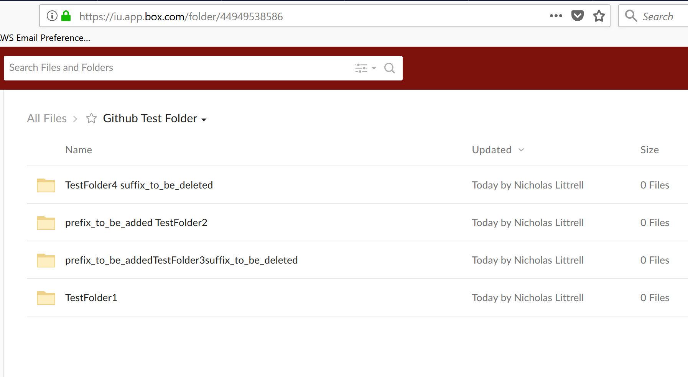
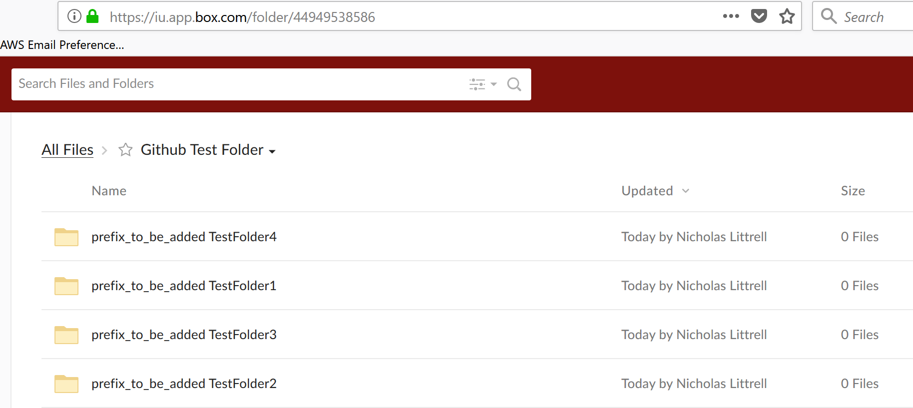

# folder-tree-rename

## Install
```
pip install -r requirements.txt
```

## Description
Folder-tree-rename renames folders with `folder_prefix` if it's not already there. It also removes `folder_suffix` at the end of the folder if it exists.

## Configuration (JWT Authentication)
Folder-tree-rename uses [`config.py`](config.py) as a configuration file. This configuration specifies the Box app's [JWT credentials](https://github.com/box-community/jwt-app-primer) as well as the runtime arguments.

* `user_id` specifies the user whose folders are to be renamed. 
* `base_folder_id` specifies the top-level folder that you want to change. For example if all of the files are in a folder called "entrusted", you would find the id of the folder in the url of the page used to access the folder, and use that value as the `base_folder_id`. If you want to run on all folders in the account, use the value '0'.


## Use Case
Below is an example folder



The config. Notice the `base_folder_id` came from the url above


Every folder now has the new prefix and none have the old suffix



Also notice every subfolder is also changed!


